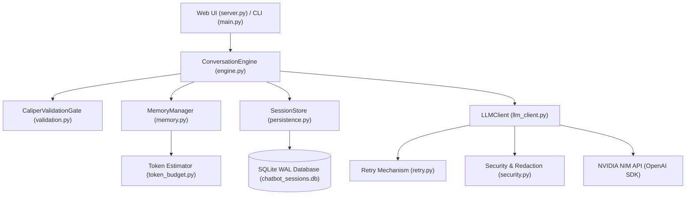

# Stateful Conversational Agent with Multi-Session & Dual-Layer Memory

> **DecodeLabs Industrial Generative AI Project 1**  
> *Production-Hardened Multi-Turn Conversational AI Agent with Priority-Budgeted Memory, SQLite Persistence, and Interactive Web Dashboard.*

---

## 🌟 Key Features

- **Priority-Tiered Memory Architecture (P1–P4)**:
  - **P1 (System Prompt)**: Non-negotiable base agent behavior.
  - **Global Memory**: Persistent, cross-session user context and preferences (injected into all chats).
  - **P2 / Local Memory**: Session-scoped pinned facts and constraints stored in SQLite metadata.
  - **P3 (Preferences)**: Dynamic user preferences.
  - **P4 (Rolling Window)**: Token-aware sliding window that automatically prunes the oldest turns when approaching context limits.
- **Context Headroom & Conservative Token Budgeting**:
  - Real-time token headroom calculation ($1\text{ token} \approx 3.0\text{ chars} + \text{safety margin}$).
  - Guaranteed room for model completions without triggering context length overflows.
- **Enterprise-Grade SQLite WAL Persistence**:
  - Fast, thread-safe session and message logging with Write-Ahead Logging (`PRAGMA journal_mode=WAL;`).
  - Cascading foreign key cleanup and busy timeouts (`PRAGMA busy_timeout=5000;`).
- **Multi-Session Web Dashboard**:
  - Interactive dark-mode chat UI built with **FastAPI** and **Tailwind CSS**.
  - Create and switch between multiple isolated conversation threads.
  - Full state restoration on page refreshes (F5) directly from SQLite.
  - Dedicated **Global Memory** tab in the sidebar and **Local Memory** slide-over drawer in the top navigation bar.
  - Real-time context headroom gauge, turn counts, and latency tracking.
- **Terminal REPL Interface**:
  - Terminal client styled with **Rich** featuring formatted panels, live status spinners, and command routing.
- **Security & Secret Protection**:
  - Environment-first secret resolution (`.env` / `NVIDIA_API_KEY`).
  - Log scrubbing filter (`SecretScrubbingFilter`) redacting API keys and authorization headers from logs.
  - Masked key previews for diagnostics and status verification.
- **Resilience & Fault Tolerance**:
  - Exponential backoff with jitter and transient status code classification (`429`, `500`, `502`, `503`, `504`).
  - Caliper validation gate with Unicode NFC normalization and control character sanitization.

---

## 🏗️ Architecture



---

## 🚀 Quick Start

### 1. Prerequisites
- Python 3.10+
- NVIDIA Developer API Key (or OpenAI-compatible endpoint)

### 2. Installation
```bash
git clone https://github.com/ZEKT-VII/stateful-conversational-agent.git
cd stateful-conversational-agent

# Install dependencies
pip install -r requirements.txt
```

### 3. Configuration
Copy `.env.example` to `.env` and insert your API credentials:
```bash
cp .env.example .env
```
Edit `.env`:
```ini
NVIDIA_API_KEY=your_nvidia_api_key_here
DEFAULT_MODEL=meta/llama-3.1-8b-instruct
MAX_CONTEXT_TOKENS=8192
RESERVED_OUTPUT_TOKENS=1024
```

### 4. Running the Web Application
Launch the local web server:
```bash
python server.py
```
Open your browser and navigate to **`http://127.0.0.1:8000`**.

### 5. Running the Terminal CLI
```bash
python main.py
```

---

## 🧪 Test Suite

The repository includes a 121+ test suite covering unit tests, integration tests, slash command routers, security filters, and live NVIDIA API memory exams:

```bash
# Run offline unit and integration tests (117+ tests)
python -m pytest tests/ -v -m "not live"

# Run live Memory Exam against NVIDIA NIM API
python -m pytest tests/test_memory_exam.py -v -m live

# Run all tests
python -m pytest tests/ -v
```

---

## 📁 Project Structure

```
├── .env.example            # Environment configuration template
├── .gitignore              # Git ignore rules protecting keys and SQLite DBs
├── commands.py             # Slash command router and CLI handlers
├── config.py               # System constants, model allowlists, and validation
├── engine.py               # Multi-turn conversation orchestrator
├── exceptions.py           # Custom domain exception hierarchy
├── llm_client.py           # NVIDIA NIM API wrapper with retry logic
├── logging_config.py       # Structured logging with SecretScrubbingFilter
├── main.py                 # Rich terminal REPL interface
├── memory.py               # Priority-budgeted memory manager (P1-P4)
├── persistence.py          # SQLite WAL session and global memory store
├── pytest.ini              # Pytest configuration and custom markers
├── requirements.txt        # Pinned dependency ranges
├── retry.py                # Exponential backoff with jitter
├── schemas.py              # Pydantic data schemas and models
├── security.py             # Secret resolution, masking, and redaction
├── server.py               # FastAPI web server and responsive dashboard
└── tests/                  # Complete test suite
    ├── test_commands.py
    ├── test_engine.py
    ├── test_logging.py
    ├── test_memory.py
    ├── test_memory_exam.py
    ├── test_persistence.py
    ├── test_retry.py
    ├── test_security.py
    ├── test_token_budget.py
    └── test_validation.py
```

---

## 📜 License
MIT License. Created as part of the DecodeLabs Generative AI Internship Program.
