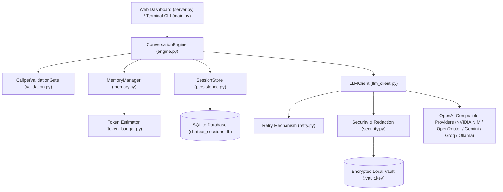

# Stateful Conversational Agent with Multi-Session, Dual-Layer Memory & Encrypted Vault

> **DecodeLabs Industrial Generative AI Project 1**  
> *Production-Hardened Multi-Turn Conversational AI Agent featuring Priority-Budgeted Memory, In-App Encrypted Credentials Vault, Multi-Provider Support, and an Interactive Dark-Mode Web Dashboard.*

---

## 🌟 Key Features

### 🔒 In-App Settings & Encrypted Local Vault
- **Zero `.env` Configuration Required**: End-users can configure API keys and model parameters directly from the in-app **Settings** tab.
- **Machine-Bound AES Fernet Encryption**: API keys are securely encrypted on disk using AES-128-CBC with HMAC-SHA256 authenticated encryption (`.vault.key`, automatically gitignored) and stored in the SQLite database.
- **Frontier AI Provider Presets (with Official Endpoints & Top Model Suggestions)**:
  - 🟢 **OpenAI (ChatGPT)** (`https://api.openai.com/v1`): `gpt-4o`, `gpt-4o-mini`, `o1`, `o3-mini`, `gpt-4-turbo`
  - 🟣 **Anthropic (Claude)** (`https://openrouter.ai/api/v1`): `anthropic/claude-3.7-sonnet`, `anthropic/claude-3.5-sonnet`, `anthropic/claude-3.5-haiku`, `anthropic/claude-3-opus`
  - 🔵 **DeepSeek (Official)** (`https://api.deepseek.com/v1`): `deepseek-chat` (DeepSeek-V3), `deepseek-reasoner` (DeepSeek-R1)
  - 🟣 **Alibaba Qwen (DashScope)** (`https://dashscope-intl.aliyuncs.com/compatible-mode/v1`): `qwen-max`, `qwen-plus`, `qwen-turbo`, `qwen-2.5-72b-instruct`, `qwq-32b`
  - 🔵 **Google Gemini (OpenAI Compat)** (`https://generativelanguage.googleapis.com/v1beta/openai/`): `gemini-2.5-flash`, `gemini-2.5-pro`, `gemini-2.0-flash`, `gemini-1.5-pro`
  - 🟢 **NVIDIA NIM (Free Dev Endpoints)** (`https://integrate.api.nvidia.com/v1`): `meta/llama-3.1-8b-instruct`, `deepseek-ai/deepseek-v4-flash-0731`, `meta/llama-3.3-70b-instruct`
  - 🟠 **Groq (Ultra-Fast LPU)** (`https://api.groq.com/openai/v1`): `llama-3.3-70b-versatile`, `llama-3.1-8b-instant`, `deepseek-r1-distill-llama-70b`
  - 🌐 **OpenRouter (Universal)** (`https://openrouter.ai/api/v1`): Access 200+ models with free and pay-as-you-go tiers
  - ⚪ **Custom OpenAI-Compatible**: Local Ollama (`http://localhost:11434/v1`), LM Studio (`http://localhost:1234/v1`), vLLM, Azure OpenAI
- **🔌 Live Connection Probe**: 1-click test button probes the endpoint and returns live response latency ($ms$) and connectivity diagnostics before saving.

---

### 🧠 Dual-Layer Memory & Priority-Tiered Budgeting (P1–P4)
- **🌐 Global Memory Layer**:
  - Cross-conversation context and persona settings stored in SQLite `global_memory`.
  - Automatically synced and injected into every existing and new chat session.
- **📌 Local Session Memory Drawer**:
  - Dedicated slide-over drawer accessible directly from the top navigation bar.
  - Pin task-specific facts, constraints, and project rules to the active conversation thread.
- **P1–P4 Priority Hierarchy**:
  - **P1**: System Instructions (Base persona & constraints).
  - **P2 / Local Memory**: Pinned identity facts & session constraints.
  - **P3**: User preferences.
  - **P4**: Rolling conversation window pruned via token-budgeted FIFO when approaching headroom limits.
- **Conservative Token Budgeting**:
  - Real-time headroom calculation ($1\text{ token} \approx 3.0\text{ chars} + \text{safety margin}$) guarantees space for model completions without triggering context length overflows.

---

### 💻 Multi-Session Web Dashboard & Modern UI
- Built with **FastAPI**, **Tailwind CSS**, and **Marked.js**.
- Create, switch between, and delete isolated conversation threads.
- Complete state restoration on browser refresh (F5) directly from SQLite.
- Live token headroom gauge, active turn counters, and round-trip latency timers.

---

### 🛡️ Enterprise Security & Resilience
- **SQLite WAL Persistence**: Write-Ahead Logging (`PRAGMA journal_mode=WAL;`) with busy timeouts (`5000ms`) and cascading foreign-key deletion.
- **Secret Scrubbing Filter**: `SecretScrubbingFilter` intercepts and redacts API keys, Bearer tokens, and authorization headers from all logs, error messages, and exception traces.
- **Fault-Tolerant Retries**: Exponential backoff with jitter for transient status codes (`429`, `500`, `502`, `503`, `504`).
- **Caliper Validation Gate**: Input sanitization with Unicode NFC normalization, null-byte removal, and control-character filtering.

---

## 🏗️ Architecture



---

## 🚀 Quick Start

### 1. Installation
```bash
git clone https://github.com/ZEKT-VII/stateful-conversational-agent.git
cd stateful-conversational-agent

# Install dependencies
pip install -r requirements.txt
```

### 2. Launch the Web Application (Recommended)
```bash
python server.py
```
1. Open your browser and navigate to **`http://127.0.0.1:8000`**.
2. Click the **`⚙️ Settings`** tab in the sidebar.
3. Select your provider preset (e.g. **NVIDIA NIM**, **Google Gemini**, **OpenRouter**, or **Groq**), enter your API key, and click **Test Connection** ➔ **Encrypt & Save Settings**.
4. You are ready to chat!

---

### 3. Launch the Terminal REPL
```bash
python main.py
```
*If no API key is configured, an interactive onboarding prompt will securely guide you through setup.*

---

## 🧪 Test Suite

The project includes an extensive **123 automated test suite** with 100% pass rate:

```bash
# Run offline unit and integration tests (121 tests)
python -m pytest tests/ -v -m "not live"

# Run live Memory Exam against live endpoints (2 tests)
python -m pytest tests/test_memory_exam.py -v -m live

# Run all tests
python -m pytest tests/ -v
```

---

## 📁 Project Structure

```
├── .env.example            # Environment configuration template
├── .gitignore              # Git ignore rules protecting keys, DBs, and vault files
├── commands.py             # Slash command router and CLI handlers
├── config.py               # System constants, model allowlists, and defaults
├── engine.py               # Multi-turn conversation orchestrator
├── exceptions.py           # Custom domain exception hierarchy
├── llm_client.py           # Multi-provider LLM client with retry logic and probes
├── logging_config.py       # Structured logging with SecretScrubbingFilter
├── main.py                 # Rich terminal REPL interface
├── memory.py               # Priority-budgeted dual-layer memory manager
├── persistence.py          # SQLite WAL store for sessions, global memory & settings
├── pytest.ini              # Pytest configuration and custom markers
├── README.md               # Complete project documentation and guide
├── requirements.txt        # Pinned dependency ranges
├── retry.py                # Exponential backoff with jitter
├── schemas.py              # Pydantic data schemas and models
├── security.py             # AES Fernet encryption, vault persistence & masking
├── server.py               # FastAPI web server and responsive dashboard
└── tests/                  # Complete test suite (123 tests)
    ├── test_commands.py
    ├── test_engine.py
    ├── test_logging.py
    ├── test_memory.py
    ├── test_memory_exam.py
    ├── test_persistence.py
    ├── test_retry.py
    ├── test_security.py
    ├── test_token_budget.py
    └── test_validation.py
```

---

## 📜 License
MIT License. Created as part of the DecodeLabs Generative AI Internship Program.
